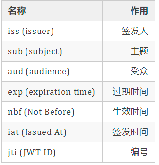
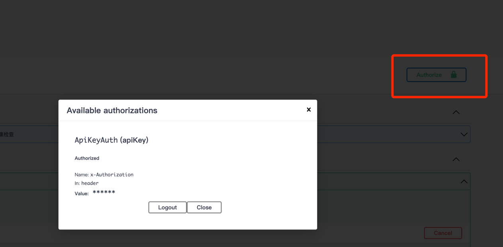

## 可能出错的地方
1. swagger报错500  解决办法： 可能是路径的问题，可以在swagger处设置`docs.SwaggerInfo.BasePath`
   1. 如果swagger的设置不是在main函数中，需要手动设置basePath `docs.SwaggerInfo.BasePath = "/"`，
   且docs的依赖不是官网的案例而是自己项目的路径`your_path/your_project/docs`
2. swagger init时候如果参数有嵌套结构(也可能是匿名内部类 我是gorm.model)会失败，[issue](https://github.com/swaggo/swag/issues/810)
   1. `swag init --parseDependency --parseInternal`
3. swagger文档在使用参数校验时是支持了[go-open-api](https://github.com/go-openapi/validate) 的validate， 而gin支持的
是[go-playground](https://github.com/go-playground/validator) 的validator
   1. 这里是看下gin怎么修改到open-api 或者是swagger修改到对方的
   2. 目前是使用swag原生注释方式在文档中表达限定条件，gin继续默认使用。 这里在struct中每个条件需要配置两次
   3. swag文档显示的按open-api的格式，gin校验的按playground的格式
4. [jwt和token+redis](https://www.zhihu.com/question/274566992) 认证方案的区别与联系，jwt比较轻量但是剔除登陆台需要额外操作。
   1. 用RSA做验签，私钥签名，公钥验签。 类似做单点登录时候可以把公钥给到服务方。
   2. RSA做加解密时候是公钥解密，私钥加密。
   3. JWT 由三部分组成：head、payload、signature，各部分通过 ‘ . ’ 连接，其中head和payload是base64url加密，这部分是可以被解密出来的。
   4. 
5. os.exit()和 panic都能退出程序，但是使用上也是有区别的 
   1. os.Exit 函数可以让当前程序以给出的状态码 code 退出。一般来说，状态码 0 表示成功，非 0 表示出错。程序会立刻终止，并且 defer 的函数不会被执行。 
   2. panic可以触发 defer延迟语句，panic还可以被recover捕获处理
6. Q: `unsupported Scan, storing driver.Value type []uint8 into type *time.Time`
   1. 在数据库连接Dsn中添加 `parseTime=true`
7. Swagger 对于需要登陆的接口，可以登陆后获取token 在页面上认真
   1. main函数注释：
    ```
         // @securityDefinitions.apikey ApiKeyAuth 
         // @name x-Authorization  这里是你的token的key
         // @in header
   ```
   2. api注释：
   ```
   // @Security ApiKeyAuth
   ```
   3. 页面操作
   
8. casbin conf文件中 g _, _ 前者是后者的成员 拥有后者的权限
9. 每写一个接口，就需要在casbin的数据库(如果没有用db就是conf.csv)中添加一条policy。不添加默认没有权限
   1. 这里只是简单的接口权限，如果有其他类型资源的权限 可以利用RBACWithDomains
  
   
   